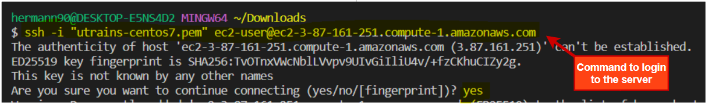

# Project2 version: 5

## 1- Set up the server using terraform and aws :
- Create a folder nammed __utrains-project__
- Enter in the folder then create the file nammed __main.tf__, using __Visual Studio Code__
- copy the content of the main.tf file form this page to your own file
- make the terraform command to set-up the server 

```
cd ~
mkdir utrains-project
cd utrains-project
mkdir project2
cd project2
code main.tf
paste below code into the main.tf file and then save.
terraform init
terraform plan
terraform apply -auto-approve
```
## min.tf file

```
# configured aws provider with proper credentials
provider "aws" {
  region    = "us-east-1"
  profile   = "default"
}

# create security group for the ec2 instance
resource "aws_security_group" "utrais_security_gp" {
  name        = "ec2 utrains security group"
  description = "allow access on ports 80 and 22 for httpd and ssh"

  # allow access on port 80 for Apache Server
  ingress {
    description      = "httpd access port"
    from_port        = 80
    to_port          = 80
    protocol         = "tcp"
    cidr_blocks      = ["0.0.0.0/0"]
  }
  # allow access on port 8080 for Jenkins Server
  ingress {
    description      = "httpd access port"
    from_port        = 8080
    to_port          = 8080
    protocol         = "tcp"
    cidr_blocks      = ["0.0.0.0/0"]
  }
  # allow access on port 22 ssh connection
  ingress {
    description      = "ssh access"
    from_port        = 22
    to_port          = 22
    protocol         = "tcp"
    cidr_blocks      = ["0.0.0.0/0"]
  }
  egress {
    from_port        = 0
    to_port          = 0
    protocol         = -1
    cidr_blocks      = ["0.0.0.0/0"]
  }
  tags   = {
    Name = "utrains server security group"
  }
}

# Generates a secure private key and encodes it as PEM
resource "tls_private_key" "instance_key" {
  algorithm = "RSA"
  rsa_bits  = 4096
}
# Create the Key Pair
resource "aws_key_pair" "instance_key" {
  key_name   = "instance_key_pair"  
  public_key = tls_private_key.instance_key.public_key_openssh
}
# Save file
resource "local_file" "ssh_key" {
  filename = "${aws_key_pair.instance_key.key_name}.pem"
  content  = tls_private_key.instance_key.private_key_pem
}

# launch the ec2 instance and install jenkis
resource "aws_instance" "ec2_instance" {
  ami                    = "ami-03bb8bc4bc848c326"
  instance_type          = "t2.medium"
  vpc_security_group_ids = [aws_security_group.utrais_security_gp.id]
  key_name               = aws_key_pair.instance_key.key_name
  //user_data            = file("installed_script.sh")

  tags = {
    Name = "utrains Server and ssh security group"
  }
}
# an empty resource block
resource "null_resource" "name" {
  # ssh into the ec2 instance 
  connection {
    type        = "ssh"
    user        = "ec2-user"
    private_key = file(local_file.ssh_key.filename)
    host        = aws_instance.ec2_instance.public_ip
  }
  # wait for ec2 to be created
  depends_on = [aws_instance.ec2_instance]
}
# print the url of the server
output "ssh_connection_command" {
  value     = join ("", ["ssh -i instance_key_pair.pem ec2-user@", aws_instance.ec2_instance.public_dns])
}
```


## 2- Login to the server:
- Copy the output command for terraform to login in the server: something like this 



###  1- At work you are in the middleware team and as such, there is a request from the DevOps team to build a jenkins server. 
### The documentation on the process to follow is in the confluence page. follow that and install a jenkins server for the devops team.
### The deliverable will be the url of jenkins server, the username and password to access jenkins.
### Confluence url: https://dataservicegroup.atlassian.net/l/cp/QLkWo2r2
### username: unixtteam24@gmail.com
### password: school123

### 2- Every month in your company, we need to patch the linux servers. To do that, we need to check some services status on the  server depending on which application is running. This is to make sure that  after patch and reboot, those services are in the same state. And in some cases, you need to shutdown some services running and bring them back after a gracefull reboot. Use below steps to patch your system as an example.

### a- check if jenkins service is runing and stop it.
#### #systemctl status jenkins
#### #systemctl stop jenkins
### b- Update the system 
#### # yum update -y  ( this command might take a long time)

### c- Do a graceful shutdown and reboot of the system.
#### # shutdown -r now
### d Log back into the server 
### e- Start the jenkins service
#### # systemctl start jenkins
### NB: When we run yum update -y at work or any yum install, yum pull the repos from the satellite server ( satellite is a server from redhat used to manage packages at work so yum doesnt go online to get packages)

### 3- There is an application running on this server thru apache, but for some reason, we are not able to start the httpd  daemon ( the apache web server daemon for centos) and this is making the application to be down. you can test that yourself by typing the ip address on the browser which will throw an error. when we run systemctl start httpd, it throws an error and point us to run systemctl status httpd to see a more verbose error message.  upon reading the message it looks like another application is consuming/using port 80. go ahead and help figure out what is that application and kill it, then start apache and check if the application is coming on your browser.

### 4- Type a command to check if port 8080 is open. 
### 5- Type a command to check what app is using port 8080.
### 6- run a command to install git on the server 
### 7- what is a soft link?
### 8- what is sticky bit ?
### 9- what is the default port for these services?  SSH, HTTP, HTTPS, FTP , DNS 
### 10- There is a file on the system that contains a list of employees called emp.csv run a command that will display just the emails of all employees.
### 11-Consider you are sitting on an interview, describe a troubleshooting scenario you encounter.


## Note : After working, don't forget to delete the infrastructure using the command below:

```
terraform destroy -auto-approve
```